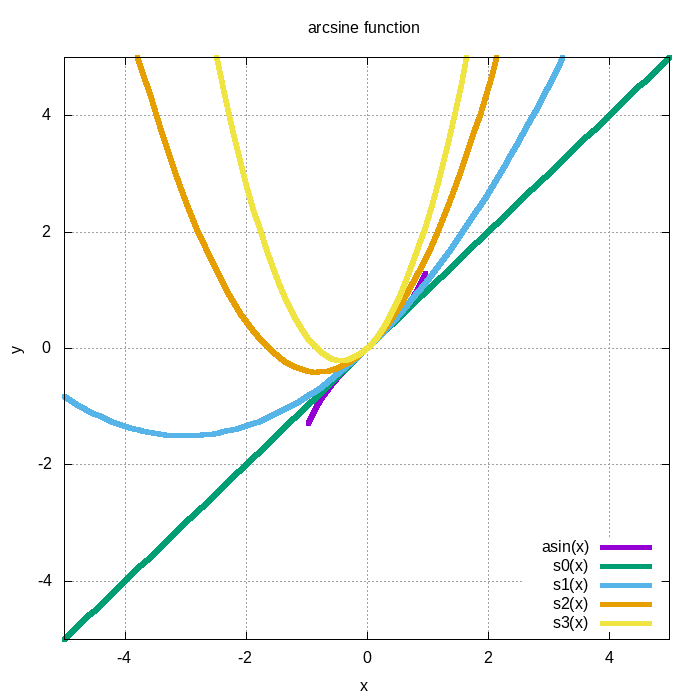

Author : Dinika Shenal Netolpitiya Mahanama Siriwardana

ID : 221AEC010

Lab Work 1 : Series

## The Contents of this folder

-> "README.md" : This readme file contains the report about this lab work

-> "arcsin.c" : This C file contains the main function of the code 

-> "arcsine.txt" : This text file contains the Arcsine function and Recurrence Formulae

-> "arcsine.gp" : This .gp file contains the script for the gnuplot

-> "arcsine.png" : This .png contains the arcsine function and first three Taylor series equations

## Report on Lab Work 1

This report discusses the functionality of the Taylor series format of the Arcsine(x) function. 

