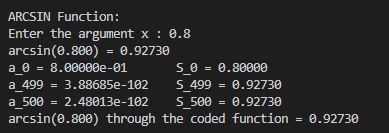
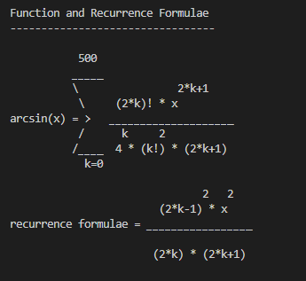

Author : Dinika Shenal Netolpitiya Mahanama Siriwardana

ID : 221AEC010

Lab Work 1 : Series

# The Contents of this folder

-> "README.md" : This readme file contains the report about this lab work

-> "arcsin.c" : This C file contains the main function of the code 

-> "arcsine.txt" : This text file contains the Arcsine function and Recurrence Formulae

-> "arcsine.gp" : This .gp file contains the script for the gnuplot

-> "arcsine.png" : This .png contains the arcsine function and first three Taylor series equations

# Report on Lab Work 1

### Introduction

This report discusses the functionality of the Taylor series format of the Arcsine(x) function. Therefore, this lab work addresses the level of similarity and accuracy of the coded Taylor series function against the Existing "asin(x)" command in the "math.h" library in C. Nonetheless, according to the results obtained in this lab work, it became evident that the Coded Taylor series function of the "Arcsin(x)" is very accurate to the answer provided by the "asin(x)" function present in the "math.h" library.

### Operation of the Lab Work

In the "arcsin.c" file, the "arcsin_solv" is the function that solves the "arcsin(x)" in the Talyor series format. This function is repeated for 500 steps in the Taylor series format, so that the accuracy of the result from the coded version is very similar to that of the existing "asin(x)" function in the "math.h" library.

The following screenshot is of the first part of the output of the compiled "arcsin.c" file, where the "x=0.8".

This C file allows the User to enter the "x" value, and the "x" value should be between -1 and +1, because the limits of the Arcsin(x) graph is from (-1<x<1).\
Furthermore, it shows the "k=0", "k=n-1" and "k=n" terms in this result. In here the "n=500", and therefore as mentionned before the Penultimate term and the Last term are shown as per the requirements of the Lab Work 1 instructions.\
Additionally, as shown in the above image, the user also witnesses the Value of the Function according to the coded Taylor series format and also the value of the function according to the "asin(x)" function existing in the "math.h" library.

Moreover, in the second half of the ouput it showcases the Taylor Series summation Formulae along with the Recurrence Formulae of the Arcsin(x) function, which is very informative to the user to understand the basic concept of the coding involved in this Lab Work 1. And a screenshot of this output part is shown below.

### Gnuplot Script and Output Image

