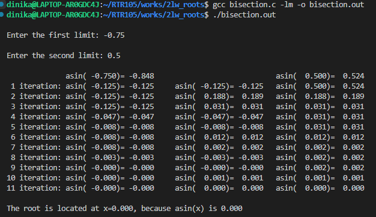
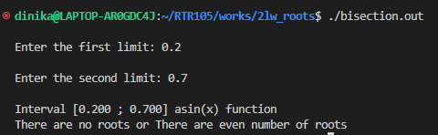

Author : Dinika Shenal Netolpitiya Mahanama Siriwardana

ID : 221AEC010

Lab Work 2 : Roots - Arcsine(x) function

# The Contents of this Folder

-> "output_screenshots" : This folder contains the screenshots of the sample output when the "first limit = -0.75 and second limit = 0.5" and also the screenshot containing the error message.

-> "README.md" : This readme file contains the report about this lab work

-> "bisection.c" : This C file contains the main function of the code

# Report on Lab Work 2

## Introduction

This report discusses the existence of roots in the Function "Arcsine(x)". 
Therefore, a code has been implemented in the "bisection.c" file according to the Mathematical Bisections method. Furthermore, the coded "arcsin_solv" function which was present in the "arcsin.c" file in the "1lw_series" folder has been copied and pasted in this "bisections.c" file in order to get the corresponding Arcsine(x) values for the user entered limits of x vlaues.
Furthermore, this lab work focuses on functions with "Odd" number of roots and it would not give a result to "Even" number of roots containing function and this was coded according to the instructions of the lecturer.

## Operation of the Lab Work

This lab work is finding the roots present within the Arcsine(x) graph. Therefore, in this coded version the Bisection Method is employed in finding the exact root of the Arcsine(x) function. And then after testing this code with various limits, it was proven that the result of this coded version of the Bisection method gave a very accurate answer like the actual root of the Arcsine(x) which has been proven in the mathematical world.\
Further to that, the Coded segment of the Bisection method part is involved in the main function present in the "bisection.c" file. \
Moreover, the coded C file is designed in a way to obtain the user input value for "first limit(a) and second limit(b)", where it allows the user to run the bisection method on the selected region of Arcsine(x) graph to explore the presence of roots. \
Additionally, the output also contains the calculations present in all the iterations until the coded version arrives at the presence of a root for the Arcsine(x) function. \
Also, then at the end of the output it presents the user with information on at which "x" value does the root exist in the Arcsine(x) graph for the user entered limits. \
Hence, the following screenshot image is a sample output of the compiled "bisection.c" file for the user entered "first limit = -0.75 and second limit = 0.5".

Conversely, as mentionned in the Introduction, this code works for the identification of "odd" number of roots and if "even" number of roots are present, then this code is designed to give a error message stating that there are even number of roots for the entered interval. \
Inaddition to that, if there are no roots present in the user entered region then the code ouputs an error message stating that there are no roots present in the user entered reqion. \
A sample screenshot of the outputted error message is shown below.

