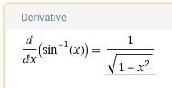
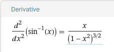
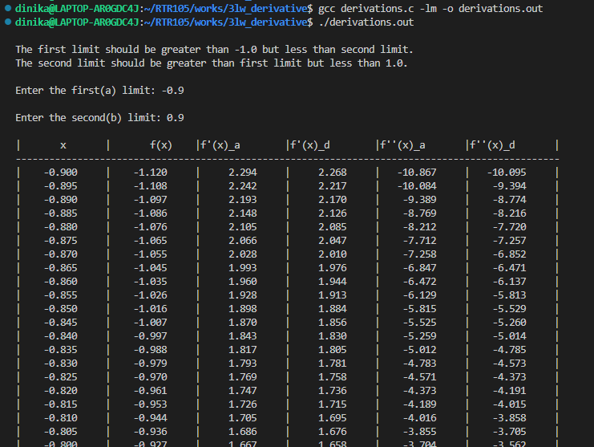
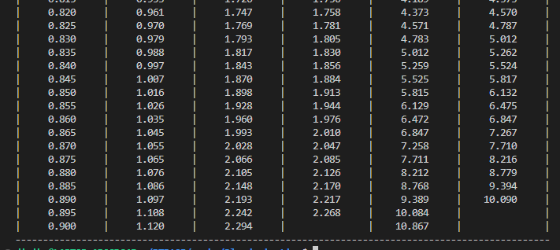

Author : Dinika Shenal Netolpitiya Mahanama Siriwardana

ID : 221AEC010

Lab Work 3 : Derivatives - Arcsine(x) function

# The Contents of this Folder

-> "sample_screenshots" : This folder contains the sample screenshots of the coded version for "first limit = -0.9 and second limit =0.9", and it also contains the screenshots of equations of First derivative and Second derivative of Arcsine(x) function.

-> "README.md" : This readme file contains the report about this lab work

-> "derivations.c" : This C file contains the main function of the code

-> "derivatives.png" : This is the image resulted from the gnuplot script for the results obtained from the "derivations.c" file.

-> "derivatives.txt" : This text file contains the outputs from the "derivations.c"

-> "derivatives.gp" : This ".gp" file contains the Gnuplot script

# Report on Lab Work 3

## Introduction

This report discusses how this Lab Work vividly present the First Order and Second Order Differentiation of Arcsine(x) function for a region entered by the User. Additionally, this lab work showcases the difference present between Analytical and Finite Difference function of the First and Second Order for the same respective x value. Consequently, a sample graph is also plotted for the results from this Lab Work which has vividly discussed in the latter part of this report.

## Operation of the Lab Work

x : the value that is calculated through the Arcsine(x) function. \
f(x) : the Arcsine(x) value for the respective x value. \
f'(x)_a : the analytical formulae of first order deriivative value of f(x). \
f'(x)_d : the finite difference formulae of first order derivative value of f(x). \
f''(x)_a : the analytical formulae of second order derivative value of f(x). \
f''(x)_d : the finite difference formulae of second order derivative value of f(x). 

The above Abbreviations are the titles of the columns in the results output of this lab work code. In the "derivations.c" file, the main code is vivid presented in a very easy to understand format. This code has been designed to get the first limit and second limit of the x from the user, in order to determine the region of x values for which to find the "f(x)" and "first order and second order equation values of this f(x)". 

Furthermore, this code has been designed to print the outputs of the compliled code in "derivations.c" file and also to orint them in the "derivatives.txt" file with only the numerical results present in the output results of the table printed. Also the current "derivatives.txt" file contains the results printed for a x region of "first limit = -0.9 and second limit = 0.9". And if the "derivations.c" file is compiled and run with some other user obtained values for "first limit and second limit" then this "derivatives.txt" file will be auto-updated with those respective results. Further to that, this "derivatives.txt" file is used to plot the gnuplot graph, which will be discussed in the latter part of this report. 

The analytical equation of the First order differential of Arcsine(x) :

The analytical equation of the Second order differential of Arcsine(x) :

The above two formulaes are being used to calculate the values of "f'(x)_a and f''(x)_a" . In addition, to that the "finite difference" values of First order derivative are calculated by determining the difference between "f(x) and f(x+1)" divided by  the difference between "(x) and (x+1)". Also the "finite difference" values of Second order derivative are calculated by determining the finite difference between "f'(x)_d and f'(x+1)_d" divided by  the difference between "(x) and (x+1)". Therefore, according to the various regions of "x" that this code was test upon, it showed that the Analytical and Finite Difference values were very similar to each other. 

The screenshot below is a sample results output for the compiled "derivations.c" file, where the user entered "first limit = -0.9 and second limit = 0.9". Since the list of results is very long, I have attached the starting portion of the results and the ending portion of the results. 

