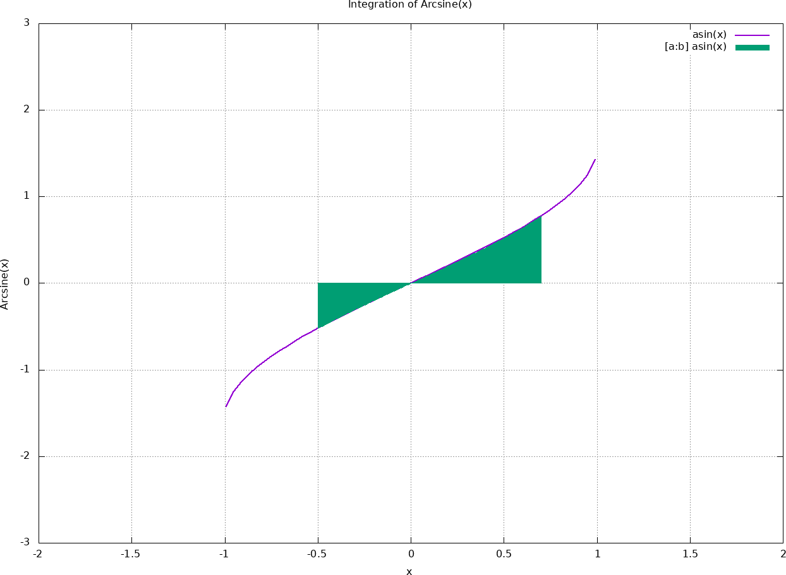

Author : Dinika Shenal Netolpitiya Mahanama Siriwardana

ID : 221AEC010

Lab Work 4 : Integral - Arcsine(x) function

# The Contents of this folder

-> "sample_screenshots" : This folder contains the screenshots of the sample outputs of the compiled codes of "integrations_rectangle.c, integrations_simpsons.c and integrations_trapezoidal.c", when the user input is "first limit = -0.5 and second limit = 0.7".

-> "README.md" : This readme file contains the report about this lab work.

-> "integral_limits.txt" : This text file contains the user entered first limit and second limit.

-> "integrations.gp" : This ".gp" file contains the script for the gnuplot.

-> "integrations.png" : This ".png" file contains the graph of the Arcsine(x) function and the Area under the curve for the integrated region.

-> "integrations_rectangle.c" : This C file contains the main function to integrate the Arcsine(x) function according to the Rectangle rule.

-> "integrations_simpsons.c" : This C file contains the main function to integrate the Arcsine(x) function according to the Simpsons rule.

-> "integrations_trapezoidal.c" : This C file contains the main function to integrate the Arcsine(x) function according to the Trapezoidal rule.

# Report on Lab Work 4

## Introduction

This report discusses the Integration of the Arcsine(x) function through various coded versions, where the various integral methods such as Rectangle Rule, Simpsons Rule and Trapezoidal Rule have been embedded in the Lab Work. These different methods are included as seperate C file formats, which can be compiled and run in order to get the desired result for the Integration of Arcsine(x) function.

## Operation of the Lab Work

Firstly, in this Lab Work as mentionned above, there are three C file which contain the unique three integration methods. These three methods have been coded according to the Proven Mathematical Formulae of their Respective Methods. In all these three C files, the three integration methods are included as seperate functions which are then called in the main function in their respective C files. 

Furthermore, one of the other interesting factors in this Lab Work is that it allows the user to enter the "first and second limits" to integrate the Arcsine(x) function. And these two limits are stored in the "integrations.txt" file, which are later used in the Gnuplot script when plotting the Area of Integration of the Arcsine(x) function. \
Also, this "integral_limits.txt" file auto-updates with the recent C file out of the three C files that is compiled and run recently, for example: if "integrations_rectangle.c" is compiled and run for user input "first limit = -0.7 and second limit = 0.7" then the "integral_limits.txt" will store "-0.7" and "0.7", and if the "integrations_simpsons.c" is then compiled and run for user intput "first limit = -0.5 and second limit = 0.5" then the "integral_limits.txt" will store "-0.5" and "0.5". Consequently, this will result in the Gnuplot script to plot the graph for the recently performed C file.

Moreover, the compiled and run versions of all the three C files do allow the user to enter the "fist and second limits", where the integration region is decided by the user, which can be witnessed in the following screenshots of the outputs. Further to that, the Each compiled and run version of the three C files do clearly present the result of the Integration of the Arcsine(x) function for the user-determined "first and second limtis".

Following image is the screenshot of the compiled output of "integrations_rectangle.c" file, and the user inputs are "first limit = -0.5 and second limit = 0.7" :

Following image is the screenshot of the compiled output of "integrations_simpsons.c" file, and the user inputs are "first limit = -0.5 and second limit = 0.7" :

Following image is the screenshot of the compiled output of "integrations_trapezoidal.c" file, and the user inputs are "first limit = -0.5 and second limit = 0.7" :

Lastly, it can be witnessed that all the three methods do give accurate results which are very similar to each other and also to the real mathematical integration of Arcsine(x) function from "-0.5 to 0.7" region.

## Gnuplot Script and Output Image

The Gnuplot script is present in "integrations.gp" file. This script is plotting the Arcsine(x) curve and the Area of the region that is integrated according the user-determined "first and second limits". Furthermore, some help from a particular website was also utised to a certain minimal level in designing the Gnuplot script and it has been referrenced in the Gnuplot script itself. 

The following image("integrations.png") is the output of a compiled code out of the three C files and where the user inputs were "first limit = -0.5 and second limit = 0.7": 

