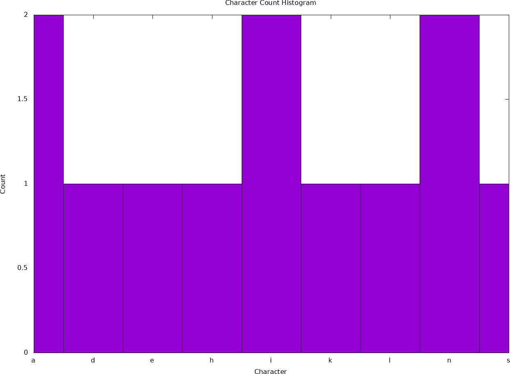

Author : Dinika Shenal Netolpitiya Mahanama Siriwardana

ID : 221AEC010

Lab Work 5 : Statistics - Sentence

# The Contents of this Folder

-> "sample_screenshots" : This folder contains the screenshots of the sample output of the compiled code of "statistics.c" for user entered "sentence : dinika shenal".

-> "README.md" : This readme file contains the report about this lab work.

-> "statistics.c" : This C file contains the main function of this Lab Work.

-> "statistics.gp" : This ".gp" file contains the script for the gnuplot.

-> "statistics.txt" : This text file contains the data about the number of occurences of each character present in the user entered sentence.

-> "statistics_histogram.png" : This ".png" contains the histogram for the number of occurences of each character present in the user entered sentence.

# Report on Lab Work 5

## Introduction

This report discusses the several statistical features that are employed on the various characters present in a user inputted sentence. In this Lab Work, the code is designed to employ the backgroud ASCII code of each character in order to perform all the required statistical functions according to the Lab Work on the user inputted sentence. Further to that, in this Lab Work, a histogram has been plotted using the Gnuplot feature in order to present the statistical number of occurences of each character present in the user inputted sentence.

## Operation of the Lab Work

Firstly, the "statistics.c" is the file that contains the main function of this Lab Work which ultimately performs various statistical functions on the characters present within a user entered sentence. This "statistics.c" file is designed to perform the following statistical features :

   1) The Minimum Character present within the Sentence. 
   2) The Maximum Character present within the Sentence. 
   3) The Average Character according to the User entered sentence. 
   4) The Median Character present within the Sentence. 
   5) The Mode Character present within the Sentence. 
   6) The Ascending Order sorting of the characters present within the User entered sentence. 
                       
Therefore there are various coded functions in the "statistics.c" file to perform these above functions. Additionally, all these statistical functions are employed on the characters present in the sentence by taking their respective ASCII Code Decimal Number into consideration. Hence, all these statistical outputs are according the respective positions of the characters in the ASCII Table.

The following image is a sample screenshot for the user entered sentence = "dinika shenal" :

Consequently, in the above image we can witness all the required statistical functions are performed on the sample user entered sentence = "dinika shenal". Hence, the "statistics.c" also have another feature where it Counts the number of occurences of each character in this user entered sentence and then prints it on the "statistics.txt" file, which is then later used in the Gnuplot script of "statistics.gp", where the user has the ability to employ this data to plot the Histogram of the Number of Occurences of each Character in the User entered sentence.

Furthermore, there are some unique case scenarios embedded in the design of this "statistics.c" file. Where the Average Character can be Present in the Sentence or Not. Henceforth, if the Average Character is Present in the Sentence, then the character present in the sentence is printed in the output as in the above image. However, if the Average Character is Not Present in the user entered sentence, then the code is designed to print an error message stating that the Average Character is Not Present in the Sentence and then will print the corresponding ASCII code Decimal value and the Character itself. \ 
The following image is a screenshot where the Average Character is Not Present in the User entered sentence : 

In addition, another unique scenario, is that before finding the Median Character Present within the Sentence, the Sentence array is ordered according to the Ascending Order eventhough the actual ordered sentence array is printed after the Median Character in the output. Also, this code is designed to find the Median Character present in the User entered sentence. \
Further to that, the spaces present within the words are ignored, which is why initially in the output, the user entered sentence is present with spaces and without spaces in the ouput. Hence, the array with the spaces ignored is the one which is employed in performing all these statistical functions.

## Gnuplot Script and Output Image

The Gnuplot script is present in the "statistics.gp" file. This script is plotting a histogram on the Number of Occurences of Each Character in the User Entered Sentence by using the data present in the "statistics.txt" file. 

The following image is the output image of the gnuplot script where the User entered sentence = "dinika shenal" :

